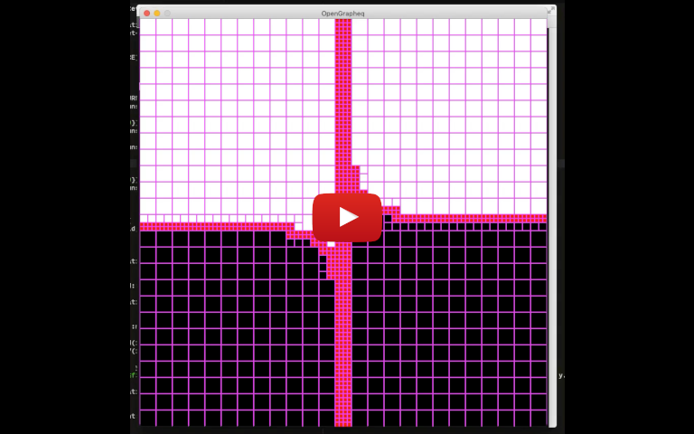
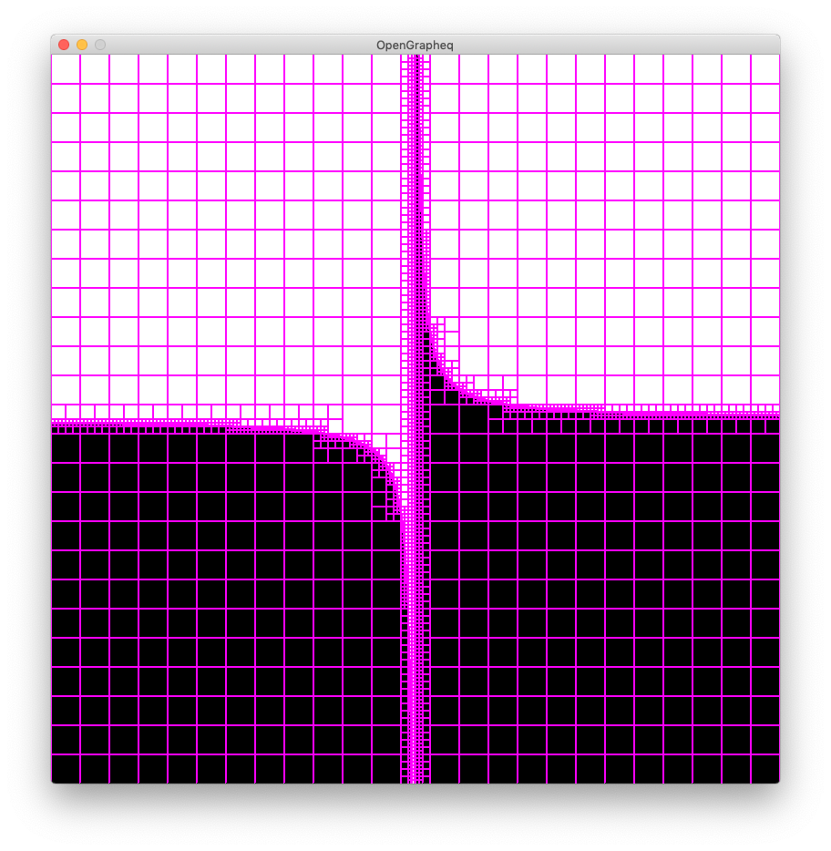

Open-GraphEq is a robust graphing application for mathematical formulae with 2 variables.

It is an open source alternative to the shareware [GrafEq](http://www.peda.com/grafeq/).

Both GrafEq and Open-GraphEq are based on the methods described in [Reliable Two-Dimensional Graphing Methods for Mathematical Formulae with Two Free Variables](http://www.dgp.toronto.edu/~mooncake/papers/SIGGRAPH2001_Tupper.pdf) by Jeff Tupper of University of Toronto, SIGGRAPH 2001.

## Status

The screenshot shows Open-GraphEq displaying a finished graph of `y < 1/x`. There is also a [demo screencast](https://youtu.be/Dp1GXxRjwaA).

Legend:
- White areas – no solutions
- Black areas – proven solutions
- Purples lines – progressively-refined grid used in the calculation

### Features:
- Graphing engine based on interval arithmetic
- Toggleable grid display
- Optional domain tracking
- Care has been taken to produce accurate results

### Planned Features:
- Optional subpixel refinement
- Optional continuity tracking
- Formula editor
- Verify floating point accuracy

## Building
Open-GraphEq uses [Shake](https://shakebuild.com/). Other than that, its sole dependency is [rolmodl](https://github.com/maximsmol/rolmodl). In addition to the system-defined lib and include paths, the build system looks for the rolmodl shared library in `./lib/rolmodl/`, and for the rolmodl header files (`./src/rolmodl/hpp/*`) in `./lib/rolmodl/hpp`.

After installing the dependencies, simply run `./build.sh` from the project folder.

## Manual
Use `./run.sh` to run the application once built.

| Key | Action |
| ---:|:------ |
| Esc | Exit |
| G | Toggle grid |
| Enter | Finish graph (does not keep track of grid refining) |
| Space | Take a step in the graphing process |

Use the mouse to select a region and dump the intervals it describes to stdout.
